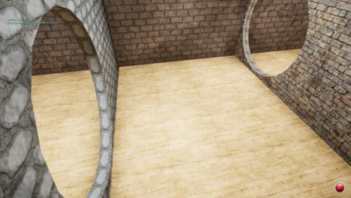
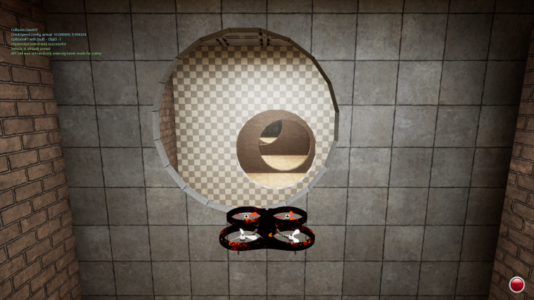

# Deep Reinforcement Learning for autonomous UAV navigation.	
[comment]: <>  (## _The Last Markdown Editor, Ever_)

[](https://nodesource.com/products/nsolid)

## Demo


## Problem Statement
 Perception and Autonomy for UAVs in tight indoor spaces is a highly challenging task especially in particular two scenarios:
- No prior maps
- No GPS coordinates.

The goal is to autonomously navigate through the below Airsim environment which has circular holes carved on the walls. The robot/agent should predict continuous actions(v) based on input camera observations(I) without colliding to any of the walls.
## Environment
<p float="left">
  
   
</p>
    
## Code
### 1. To start conda environment:
```
$ conda activate rl0
```
<!---
Go to the below location and then start `TrainEnv.exe` present at below location
```
$ .\RL-UAV\Airsim-Env\TrainEnv
```
-->

### 2. Training
To start training the poilcy(PPO or SAC)
```
$ python trainPPO.py or
$ python trainSAC.py
```

### 3. Log Monitoring
To monitor logs with tensorboard use below command by replace with your own logdir:
```
$ tensorboard --logdir tb_logs/ppo_run_1733388980.4439118_1
```

### 4. Inference

```
$ python inference.py
```
<!-- To start inference start `TestEnv.exe` present at below location:
```
$ .\RL-UAV\Airsim-Env\TrainEnv`
``` -->


### References 
+ "Reaching the limit in autonomous racing: Optimal control versus reinforcement learning." Song, Yunlong, Angel Romero, Matthias Müller, Vladlen Koltun, and Davide Scaramuzza. Science Robotics, (2023)

+  "Proximal policy optimization algorithms", Schulman, J., Wolski, F., Dhariwal, P., Radford, A., & Klimov, O., arXiv preprint arXiv:1707.06347.  (2017). 

+ "Soft Actor-Critic: Off-Policy Maximum Entropy Deep Reinforcement Learning with a Stochastic Actor", Haarnoja, Tuomas, Aurick Zhou, Pieter Abbeel, and Sergey Levine, In International conference on machine learning, pp. 1861-1870. PMLR, 2018.

+ "Deep-Reinforcement-Learning-Based Autonomous UAV Navigation With Sparse Rewards," C. Wang, J. Wang, J. Wang and X. Zhang, in IEEE Internet of Things Journal, vol. 7, no. 7, pp. 6180-6190, July 2020.

+ "Autonomous UAV navigation via deep reinforcement learning using PPO." Kabas, Bilal, 2022 30th Signal Processing and Communications Applications Conference (SIU). IEEE, 2022.

+ "Autonomous uav navigation using reinforcement learning.", Pham, Huy X., et al, arXiv preprint arXiv:1801.05086 (2018).


### License

MIT


